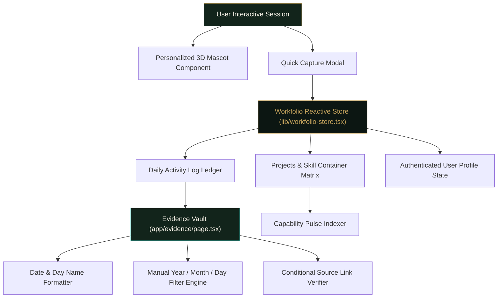
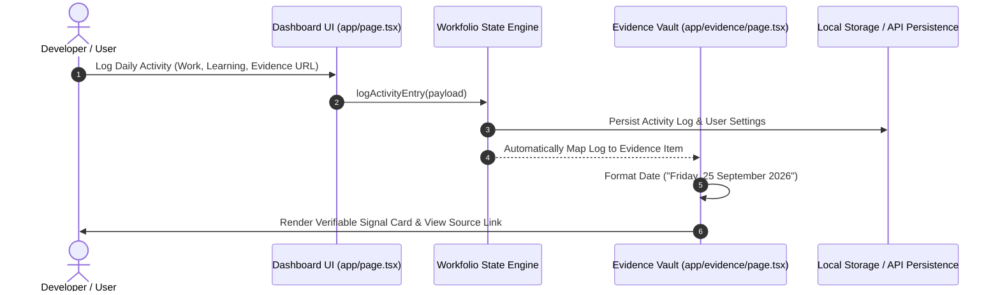

# Workfolio — Personal Work Operating System & Verifiable Proof Ledger

[](https://nextjs.org/)
[](https://www.typescriptlang.org/)
[](https://tailwindcss.com/)
[](https://reactjs.org/)
[](LICENSE)

> **Workfolio** is a modern, privacy-first personal engineering operating system and verifiable proof ledger. It transforms daily coding updates, system builds, and learning milestones into immutable evidence logs backed by real user authentication and interactive 3D mascot telemetry.

---

## 📸 System Showcase & Visual Interface

| Interactive 3D Mascot Studio | Workfolio Evidence Vault |
| :---: | :---: |
|  |  |
| *Real-time 180° cursor head tracking, dynamic avatar customization, and settings modal.* | *Date-grouped work history, manual Year/Month/Day filters, and source links.* |

| Digital Workspace Studio | Active Builds & Capabilities |
| :---: | :---: |
|  |  |
| *Embedded media stream player, custom audio controls, and external studio integration.* | *Project container tracking, skill milestone paths, and capability pulse matrices.* |

---

## 🏗️ System Architecture & Data Pipeline

The following flowcharts illustrate the decoupled reactive store, authentication workflow, and evidence indexing pipeline inside Workfolio:



### Data Synchronization Flow



---

## ✨ Key Features & Engineering Highlights

### 1. 🤖 Interactive 3D Mascot & Telemetry System
- **180° Head Rotation**: Real-time cursor tracing restricted to avatar boundaries, returning to a neutral center position when the cursor leaves the frame.
- **Gender & Personalization**: Smooth switching between Male and Female bitmoji representations.
- **Custom Aesthetic**: Custom shirt color grading (`#794f38`) optimized for high-contrast dark green (`#12241b`) and warm ivory (`#f3eee4`) background themes.
- **Embedded Settings Modal**: User name, gender preference, and API key management unified in a glowing control pill.

### 2. 🛡️ Verifiable Evidence Vault & Manual Date Indexing
- **Automatic Activity Mapping**: 100% of logged daily updates automatically format into verifiable proof cards.
- **Date & Day Name Grouping**: Work history categorized with day name and date formatting (e.g., `Friday, 25 September 2026`).
- **Interactive Day Pills**: Clickable date pills (e.g. `[ Friday, 25 Sep 2026 (2) ]`) instantly filter all work items performed on that exact day.
- **Manual Date Selectors**: Granular filter controls allowing individual manual selection of **Year**, **Month**, and **Day Date**.
- **Conditional Link Verification**: The `View Source ↗` button appears strictly when a valid GitHub repository or project link is provided.

### 3. 🌊 Digital Workspace Studio ("OCEAN")
- **Clean Video Player**: YouTube stream player with no overlay buttons or background interference.
- **Dedicated Audio Controls**: Independent `PLAY VIDEO` and `PAUSE VIDEO` control buttons.
- **New Window Integration**: Video click triggers pause and opens the full **Digital Workspace Studio** in a dedicated new tab/window (`target="_blank"`).
- **Highlighted Action CTA**: Prominent `+ CREATE DIGITAL WORKSPACE` button featuring metallic gold gradient styling and glowing shadow effects.

### 4. 📊 Projects, Learning Tracks & Capabilities
- **Uncluttered UI**: Clean, editorial typography layout with redundant workspace subheaders removed.
- **Structured Projects**: Container tracking for Active, Completed, and Archived builds.
- **Skills Matrix**: Focused learning goals, blocker logs, and capability progression tracking.

---

## 🛠️ Tech Stack & Dependencies

- **Framework**: [Next.js 14 / 16 (App Router)](https://nextjs.org/)
- **Language**: [TypeScript 5.0](https://www.typescriptlang.org/)
- **Styling**: [Tailwind CSS 3.4](https://tailwindcss.com/) with CSS variables
- **UI Icons**: [Lucide React](https://lucide.dev/)
- **Bundler**: Webpack with Next.js Compiler
- **State Management**: React Context API with custom persistent hook (`useWorkfolio`)

---

## 📁 Repository Directory Structure

```dir
mono-e-commerce-template/
├── app/
│   ├── page.tsx                 # Authenticated Dashboard Home
│   ├── evidence/
│   │   └── page.tsx             # Evidence Vault with Date & Filter controls
│   ├── ocean/
│   │   └── page.tsx             # Digital Workspace Showcase & Player
│   ├── digital-workspace/
│   │   └── page.tsx             # Standalone Interactive Digital Workspace Studio
│   ├── learning/
│   │   └── page.tsx             # Skills, Learning Logs & Goal Trackers
│   ├── projects/
│   │   └── page.tsx             # Projects Directory & Workspaces
│   └── capabilities/
│       └── page.tsx             # Capability Signal Matrix
├── components/
│   ├── workfolio-header.tsx     # Clean Sticky Navigation Bar
│   ├── workfolio-mascot.tsx     # Interactive 3D Bitmoji Mascot & Head Tracker
│   ├── quick-capture-modal.tsx  # Daily Activity Logging Modal
│   ├── auth-modal.tsx           # Settings & User Profile Modal
│   └── activity-heatmap.tsx     # GitHub-style Activity Contribution Heatmap
├── lib/
│   └── workfolio-store.tsx      # Unified Reactive State & Persistence Engine
├── public/
│   └── images/                  # High-resolution screenshots and assets
├── README.md                    # Repository Documentation
├── package.json                 # Node dependencies and scripts
└── tsconfig.json                # TypeScript compiler configuration
```

---

## 🚀 Quick Start Guide

### Prerequisites
- **Node.js**: `v18.17.0` or higher
- **Package Manager**: `npm` or `pnpm`

### 1. Clone & Install Dependencies
```bash
git clone https://github.com/me7Ayushrana/workfolio.git
cd workfolio
npm install
```

### 2. Run Development Server
```bash
npm run dev
```
Open [http://localhost:3000](http://localhost:3000) in your browser to explore the dashboard.

### 3. Production Build & Compilation
```bash
npx next build --webpack
npm run start
```

---

## 🤝 Contributing & License

Contributions, issue reports, and feature proposals are welcome! Please open an issue or submit a pull request on GitHub.

Distributed under the **MIT License**. See `LICENSE` for more information.

---

<p align="center">
  <b>WORKFOLIO</b> · TRACE THE TASK · Your work. Your proof. Your profile.
</p>
